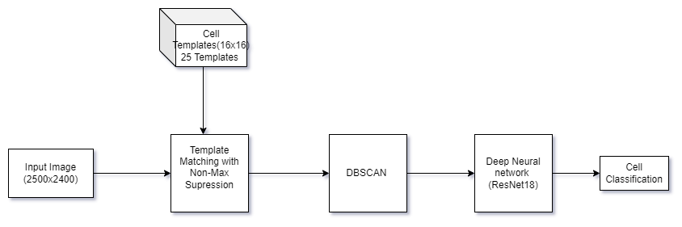

# Medical_Image_Cell_Identification

### Architecture of Multi-Stage Classification of Cells:

#### Stage 1: Template Matching with Non Max Supression

#### Stage 2: DBSCAN Clustering 

#### Stage 3: ResNet18 
